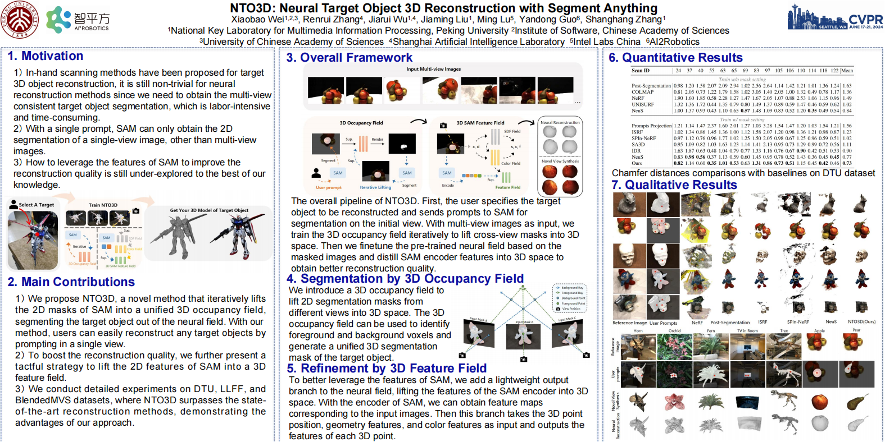

# NTO3D: Neural Target Object 3D Reconstruction with Segment Anything

> [NTO3D: Neural Target Object 3D Reconstruction with Segment Anything](http://openaccess.thecvf.com/content/CVPR2024/papers/Wei_NTO3D_Neural_Target_Object_3D_Reconstruction_with_Segment_Anything_CVPR_2024_paper.pdf)  
> [Xiaobao Wei](https://ucwxb.github.io/), [Renrui Zhang](https://zrrskywalker.github.io/), [Jiarui Wu](https://gnwekge78707.github.io/), [Jiaming Liu](https://liujiaming1996.github.io/), [Ming Lu](https://lu-m13.github.io/), Yandong Guo, [Shanghang Zhang](https://www.shanghangzhang.com/)$^\dagger$  
> CVPR2024 Main Conference Paper  
> $\dagger$ Corresponding author

<p align='center'>
  
</p>

We propose NTO3D, a novel method leveraging Segment Anything Model (SAM) for high-quality target object 3D reconstruction.


## Overview
<p align='center'>
  
</p>

Neural 3D reconstruction from multi-view images has recently attracted increasing attention from the community. Existing methods normally learn a neural field for the whole scene, while it is still under-explored how to reconstruct a target object indicated by users. Considering the Segment Anything Model (SAM) has shown effectiveness in segmenting any 2D images, in this paper, we propose NTO3D, a novel high-quality Neural Target Object 3D (NTO3D) reconstruction method, which leverages the benefits of both neural field and SAM. We first propose a novel strategy to lift the multi-view 2D segmentation masks of SAM into a unified 3D occupancy field. The 3D occupancy field is then projected into 2D space and generates the new prompts for SAM. This process is iterative until convergence to separate the target object from the scene. After this, we then lift the 2D features of the SAM encoder into a 3D feature field in order to improve the reconstruction quality of the target object. NTO3D lifts the 2D masks and features of SAM into the 3D neural field for high-quality neural target object 3D reconstruction. We conduct detailed experiments on several benchmark datasets to demonstrate the advantages of our method.

## Getting Started

### Environmental Setups
We recommend using conda for the installation of dependencies. Please enter the following command step by step for preparing the environment:

```bash
git clone https://github.com/ucwxb/NTO3D
cd NTO3D
conda env create -f env.yaml
conda activate NTO3D

pip install -r requirements.txt
pip install git+https://github.com/NVlabs/tiny-cuda-nn/#subdirectory=bindings/torch
```

Download pretrained [SAM](https://dl.fbaipublicfiles.com/segment_anything/sam_vit_h_4b8939.pth) in the current folder. 

```bash
wget https://dl.fbaipublicfiles.com/segment_anything/sam_vit_h_4b8939.pth
```

### Preparing Dataset
We conduct experiments on DTU24 dataset following [NeuS](https://lingjie0206.github.io/papers/NeuS/). We also provide a sample scene. Please download the scene "dtu_scan55" on the [google drive](https://drive.google.com/file/d/16QcrTizL12YsgMlWhmz2MyDrCy7cnenl/view?usp=sharing) and move it into the `datasets` folder. 

```bash
mkdir datasets
cd datasets
pip install gdown
gdown 16QcrTizL12YsgMlWhmz2MyDrCy7cnenl
unzip dtu.zip
```

Then you can run the following command to train NTO3D on the sample scene:

```bash
bash scripts/train_dtu55.sh
```

## Citation

If you find this project helpful, please consider citing the our paper:

```bibtex
@inproceedings{wei2024nto3d,
  title={Nto3d: Neural target object 3d reconstruction with segment anything},
  author={Wei, Xiaobao and Zhang, Renrui and Wu, Jiarui and Liu, Jiaming and Lu, Ming and Guo, Yandong and Zhang, Shanghang},
  booktitle={Proceedings of the IEEE/CVF Conference on Computer Vision and Pattern Recognition},
  pages={20352--20362},
  year={2024}
}
```