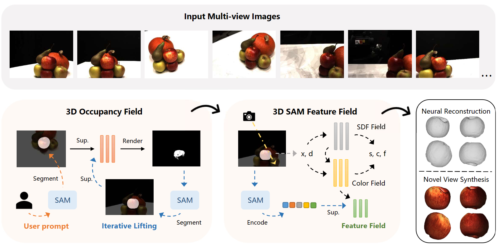

# NTO3D: Neural Target Object 3D Reconstruction with Segment Anything

Official code release for [NTO3D: Neural Target Object 3D Reconstruction with Segment Anything](https://arxiv.org/pdf/2309.12790)  (Accepted by CVPR 2024, arxiv to be updated).

  <b>
    <a href="https://arxiv.org/pdf/2309.12790">Paper</a>
    |
    <a href="https://github.com/ucwxb/NTO3D">Code</a> 
  </b>

 
  

    
  

**Abstract**: Neural 3D reconstruction from multi-view images has recently attracted increasing attention from the community. Existing methods normally learn a neural field for the whole scene, while it is still under-explored how to reconstruct a target object indicated by users. Considering the Segment Anything Model (SAM) has shown effectiveness in segmenting any 2D images, in this paper, we propose NTO3D, a novel high-quality Neural Target Object 3D (NTO3D) reconstruction method, which leverages the benefits of both neural field and SAM. We first propose a novel strategy to lift the multi-view 2D segmentation masks of SAM into a unified 3D occupancy field. The 3D occupancy field is then projected into 2D space and generates the new prompts for SAM. This process is iterative until convergence to separate the target object from the scene. After this, we then lift the 2D features of the SAM encoder into a 3D feature field in order to improve the reconstruction quality of the target object. NTO3D lifts the 2D masks and features of SAM into the 3D neural field for high-quality neural target object 3D reconstruction. We conduct detailed experiments on several benchmark datasets to demonstrate the advantages of our method. The code will be released.

